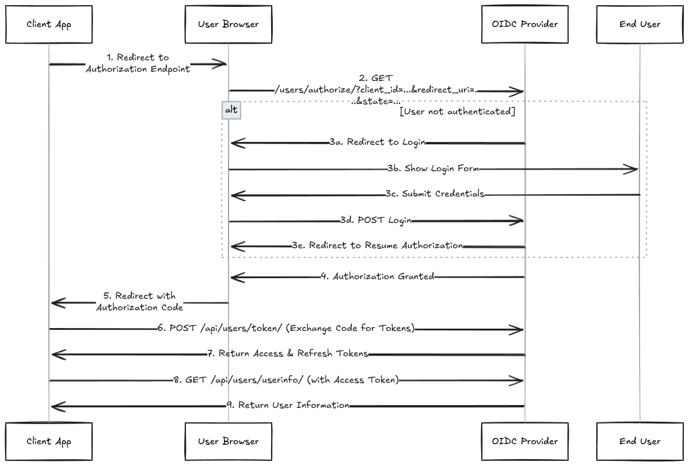

# SSO Flow Documentation

This document explains the OAuth2 and OpenID Connect (OIDC) authentication flow implemented in the Django OIDC Provider.

## Overview

The Django OIDC Provider implements the **Authorization Code Flow** as specified in:

- [RFC 6749 - OAuth 2.0 Authorization Framework](https://datatracker.ietf.org/doc/html/rfc6749)
- [OpenID Connect Core 1.0](https://openid.net/specs/openid-connect-core-1_0.html)

## Flow Diagram



## Detailed Flow Steps

### 1. Authorization Request

The client application initiates the flow by redirecting the user to the authorization endpoint:

```
GET /users/authorize/?client_id={client_id}&redirect_uri={redirect_uri}&scope={scope}&state={state}&response_type=code
```

**Parameters:**

- `client_id` - The application's client identifier
- `redirect_uri` - Where to redirect after authorization
- `scope` - Requested permissions (e.g., "openid email profile")
- `state` - CSRF protection token
- `response_type` - Must be "code" for authorization code flow

**Implementation:** `AuthorizeView.get()` in `django_sso/users/web/views.py`

### 2. Authorization Server Processing

The authorization server validates the request:

```python
# Validate client_id
client = Application.objects.filter(client_id=client_id, is_active=True).first()
if not client:
    return self._error_redirect(redirect_uri, state, "invalid_client")

# Validate redirect_uri
if normalize_uri(redirect_uri) not in client.get_redirect_uris():
    return self._error_redirect(redirect_uri, state, "invalid_redirect_uri")

# Validate and filter scopes
requested_scopes = scope.split()
allowed_scopes = set(client.get_allowed_scopes())
granted_scopes = [s for s in requested_scopes if s in allowed_scopes]
```

### 3. User Authentication

If the user is not authenticated, they are redirected to the login page:

```python
if not request.user.is_authenticated:
    login_url = reverse("accounts:web:login")
    query_params = {"next": reverse("accounts:web:resume_authorization")}
    login_url += f"?{urlencode(query_params)}"
    return redirect(login_url)
```

The OIDC context is stored in the session:

```python
request.session["oidc_context"] = {
    "client_id": client_id,
    "redirect_uri": redirect_uri,
    "state": state,
    "scope": granted_scopes,
    "timestamp": now().isoformat(),
}
```

### 4. Authorization Code Generation

After successful authentication, an authorization code is generated:

```python
def create_and_cache_auth_code(user, client, redirect_uri, scopes, code_length=40):
    code = secrets.token_urlsafe(code_length)

    data = {
        "user_id": str(user.id),
        "client_id": str(client.id),
        "redirect_uri": redirect_uri,
        "issued_at": now().isoformat(),
        "scopes": scopes,
        "used": False,
    }

    cache.set(f"auth_code:{code}", json.dumps(data), timeout=settings.AUTH_CODE_TTL)
    return code
```

### 5. Authorization Response

The user is redirected back to the client with the authorization code:

```
HTTP/1.1 302 Found
Location: {redirect_uri}?code={authorization_code}&state={state}
```

### 6. Token Exchange

The client exchanges the authorization code for tokens:

```
POST /api/users/token/
Content-Type: application/json

{
    "client_id": "your_client_id",
    "client_secret": "your_client_secret",
    "code": "authorization_code",
    "redirect_uri": "https://your-app.com/callback",
    "grant_type": "authorization_code"
}
```

**Implementation:** `TokenView.post()` in `django_sso/users/api/views.py`

### 7. Token Response

The authorization server responds with tokens:

```json
{
  "access_token": "eyJhbGciOiJIUzI1NiIsInR5cCI6IkpXVCJ9...",
  "token_type": "bearer",
  "expires_in": 900,
  "refresh_token": "random_refresh_token_string"
}
```

### 8. User Info Request

The client can request user information using the access token:

```
GET /api/users/userinfo/
Authorization: Bearer {access_token}
```

### 9. User Info Response

The server returns user information based on granted scopes:

```json
{
  "sub": "user_id",
  "email": "user@example.com",
  "email_verified": true,
  "name": "username",
  "given_name": "First",
  "family_name": "Last",
  "profile_picture": "https://example.com/avatar.jpg"
}
```

## Security Features

### State Parameter

The `state` parameter provides CSRF protection:

- Generated by the client
- Included in authorization request
- Returned unchanged in the response
- Client must validate it matches

### Authorization Code Properties

- **Single Use**: Codes are marked as used after token exchange
- **Short Lifetime**: Configurable via `AUTH_CODE_TTL` (default: 10 minutes)
- **Bound to Client**: Codes are tied to specific client and redirect URI

### Session Management

- **Session Expiry**: OIDC context expires after `AUTH_CODE_TTL`
- **Session Isolation**: Each authorization request uses independent session data
- **Cleanup**: Expired sessions are automatically cleaned up

### Token Security

- **JWT Access Tokens**: Signed with `SSO_JWT_SECRET_KEY`
- **Refresh Token Rotation**: New refresh tokens issued on refresh
- **Token Blacklisting**: Revoked tokens are blacklisted
- **Scope Limitation**: Tokens carry only granted scopes

## Error Handling

### Authorization Errors

Common error responses during authorization:

- `invalid_request` - Missing required parameters
- `invalid_client` - Unknown or inactive client
- `invalid_redirect_uri` - Redirect URI not registered
- `invalid_scope` - Requested scope not allowed
- `access_denied` - User denied authorization

### Token Errors

Common error responses during token exchange:

- `invalid_client` - Invalid client credentials
- `invalid_grant` - Invalid or expired authorization code
- `invalid_request` - Malformed request

### Error Response Format

Errors are returned as query parameters to the redirect URI:

```
{redirect_uri}?error=invalid_client&state={state}
```

Or as JSON for API endpoints:

```json
{
  "error": "invalid_grant",
  "error_description": "Invalid or expired authorization code"
}
```

## Scopes

### Supported Scopes

- `openid` - Required for OIDC, enables ID token
- `email` - Access to email and email_verified claims
- `profile` - Access to profile information (name, given_name, family_name, etc.)

### Scope Configuration

Scopes are configured per application in the admin interface:

```python
# In Application model
allowed_scopes = models.TextField(default="openid email profile")

def get_allowed_scopes(self):
    return [s.strip() for s in self.allowed_scopes.split() if s.strip()]
```

## Session Management

### OIDC Context Storage

The authorization context is stored in Django sessions:

```python
request.session["oidc_context"] = {
    "client_id": client_id,
    "redirect_uri": redirect_uri,
    "state": state,
    "scope": granted_scopes,
    "timestamp": now().isoformat(),
}
```

### Context Expiry

Session context expires after the configured timeout:

```python
def _is_session_expired(self, context):
    if not context or "timestamp" not in context:
        return True

    try:
        timestamp = datetime.fromisoformat(context["timestamp"])
        return now() > timestamp + timedelta(seconds=settings.AUTH_CODE_TTL)
    except (ValueError, TypeError):
        return True
```

## Refresh Token Flow

### Token Refresh Request

```
POST /api/users/token/refresh/
Content-Type: application/json

{
    "refresh_token": "your_refresh_token"
}
```

### Refresh Response

```json
{
  "access_token": "new_access_token",
  "token_type": "bearer",
  "expires_in": 900,
  "refresh_token": "new_refresh_token"
}
```

## Integration Examples

### Web Application Integration

```javascript
// Redirect to authorization endpoint
window.location.href =
  "https://your-oidc-provider.com/users/authorize/?" +
  "client_id=your_client_id&" +
  "redirect_uri=https://your-app.com/callback&" +
  "scope=openid email profile&" +
  "state=random_state_value&" +
  "response_type=code";

// Handle callback
const urlParams = new URLSearchParams(window.location.search);
const code = urlParams.get("code");
const state = urlParams.get("state");

// Exchange code for tokens
const response = await fetch(
  "https://your-oidc-provider.com/api/users/token/",
  {
    method: "POST",
    headers: { "Content-Type": "application/json" },
    body: JSON.stringify({
      client_id: "your_client_id",
      client_secret: "your_client_secret",
      code: code,
      redirect_uri: "https://your-app.com/callback",
      grant_type: "authorization_code",
    }),
  }
);

const tokens = await response.json();
```

## Best Practices

### Client Applications

1. **Always validate state parameter**
2. **Use HTTPS for all communications**
3. **Store client secrets securely**
4. **Implement proper token storage**
5. **Handle token refresh automatically**

### OIDC Provider Configuration

1. **Use strong JWT secrets**
2. **Configure appropriate token lifetimes**
3. **Implement rate limiting**
4. **Monitor for suspicious activity**
5. **Regular security audits**
